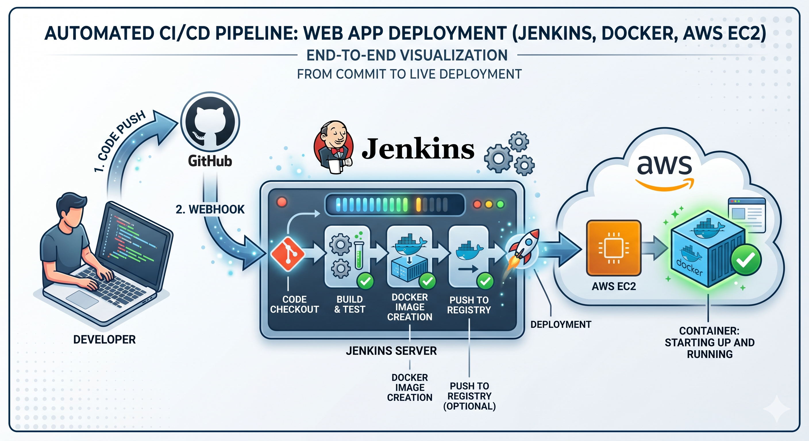
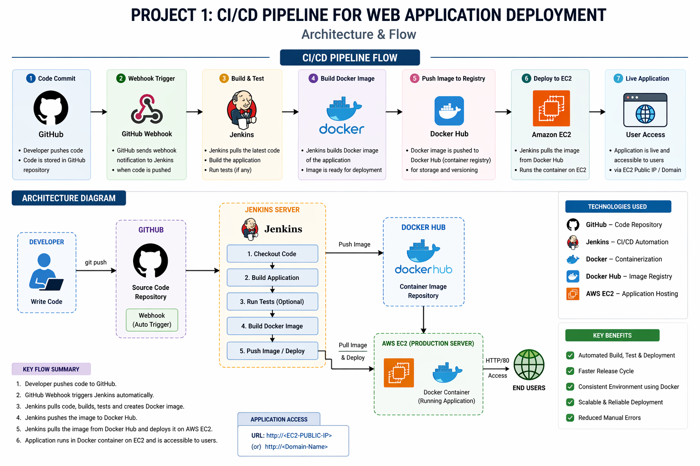

# Automated CI/CD Pipeline with Jenkins, Docker, and AWS

## 📌 Project Overview
This project demonstrates a fully automated Continuous Integration and Continuous Deployment (CI/CD) pipeline for a web application. By integrating GitHub, Jenkins, Docker, and AWS EC2, this architecture eliminates manual deployment steps, significantly reduces human error, and accelerates the release cycle. 

The pipeline ensures that every code push is automatically built, tested, and deployed consistently across environments using containerization.

## 🏗️ Architecture & Workflow
The deployment lifecycle is managed via a `Jenkinsfile` and triggered automatically via GitHub Webhooks.

1. **Continuous Integration (CI):**
   * **Trigger:** A developer pushes code to the GitHub repository.
   * **Checkout:** GitHub Webhooks trigger the Jenkins server to pull the latest code.
   * **Build & Test:** Jenkins compiles the application and runs automated tests to ensure code integrity.
2. **Continuous Deployment (CD):**
   * **Containerization:** A new Docker image is built using the validated code.
   * **Registry Push:** The Docker image is pushed to a container registry (e.g., Docker Hub / Amazon ECR).
   * **Deployment:** Jenkins connects to the target AWS EC2 instance, pulls the latest Docker image, and spins up the container, resulting in a lightweight, scalable deployment.

## 🛠️ Technologies & Tools
* **Version Control:** Git, GitHub
* **CI/CD Automation:** Jenkins (Declarative Pipeline)
* **Containerization:** Docker
* **Cloud Infrastructure:** AWS EC2
* **OS/Environment:** Linux (Ubuntu)

## 🚀 Getting Started

### Prerequisites
* An active AWS account with an EC2 instance provisioned.
* Jenkins installed and configured with the required plugins (GitHub Integration, Docker Pipeline, SSH).
* Docker installed on both the Jenkins server and the target EC2 instance.

### Pipeline Configuration
1. Clone this repository.
2. Configure a Webhook in the GitHub repository settings pointing to your Jenkins server IP: `http://<JENKINS_IP>:8080/github-webhook/`
3. Add your AWS EC2 SSH credentials and Docker Hub credentials to the Jenkins Credentials Manager.
4. Create a new Pipeline job in Jenkins and point it to the `Jenkinsfile` in this repository.

## 🛣️ Future Enhancements (Roadmap)
I am currently enhancing this project by migrating toward orchestration and zero-downtime deployments. Planned upgrades include:

- [ ] **Container Orchestration:** Integrating **Kubernetes (EKS / Minikube)** to replace standalone EC2 deployments for high availability.
- [ ] **Deployment Strategies:** Implementing **Blue-Green Deployments** to ensure zero-downtime releases.
- [ ] **Modern CI/CD:** Replicating the pipeline using **GitHub Actions** for native repository integration.
- [ ] **Resilience:** Adding automated rollback mechanisms in the pipeline in case of health-check failures.
- [ ] **Security:** Storing images securely using Amazon ECR instead of public registries.

---
*Developed to showcase modern DevOps practices, automation, and cloud-native deployments.*
